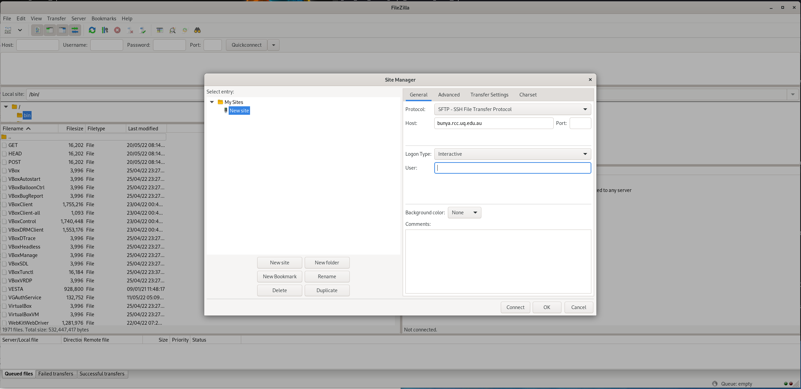

# Bunya (very short) user guide

## Quick links

* [Connecting to Bunya](https://github.com/UQ-RCC/hpc-docs/blob/main/Bunya-User-Guide.md#connecting)
* [Transferring files](https://github.com/UQ-RCC/hpc-docs/blob/main/Bunya-User-Guide.md#file-transfer)
* [Software on Bunya](https://github.com/UQ-RCC/hpc-docs/blob/main/Bunya-User-Guide.md#software)
* [Using software containers on Bunya](https://github.com/UQ-RCC/hpc-docs/blob/main/Bunya-User-Guide.md#using-software-containers-on-bunya)
* [Interactive batch jobs](https://github.com/UQ-RCC/hpc-docs/blob/main/Bunya-User-Guide.md#interactive-jobs)
* [SLURM scripts and examples](https://github.com/UQ-RCC/hpc-docs/blob/main/Bunya-User-Guide.md#slurm-scripts)
* [How to check jobs in SLURM](https://github.com/UQ-RCC/hpc-docs/blob/main/Bunya-User-Guide.md#how-to-check-jobs-in-slurm)
* [RCC's interactive job script builder for SLURM](https://shiny.rcc.uq.edu.au/SLURM/)

## General HPC information 

General HPC training is available via the [RCC and QCIF Training resources](https://www.qcif.edu.au/training/hpc-training-resources/).

To get a basic understanding of what you need to be aware of when using HPC for your research please listen to the following videos:

[Connecting to HPC via putty](https://youtu.be/oP_5JJrMm1U) 
[Transferring files with FileZilla](https://youtu.be/9ABMxcKqfkQ) 
[Where does my data go on HPC](https://youtu.be/cNW7F9V1plA) 
[Directories (folders) I should be aware of on HPC](https://youtu.be/rgfbORJLOa8) 
[Message of the day (info on current status and problems)](https://youtu.be/B33OKA2QwyI) 
[Relative and absolute path (common problem in user scripts)](https://youtu.be/XBG7QpGGY9E) 
[How to load installed software](https://youtu.be/AN0zqXj06N4) 
[Why no calculation should be run on the login nodes](https://youtu.be/FYqzSP6HWs8) 
[PBS qstat (monitoring jobs)](https://youtu.be/R7uJ1-_AV_o) 
[PBS qsub (submitting jobs)](https://youtu.be/Li_h_6PaCe4) 
[PBS qdel (deleting jobs)](https://youtu.be/gz5ExFmtDEk) 

For UQ users and QCIF users with a QRIScloud collection please also listen to

[General overview of Q RDM](https://youtu.be/zI3jQfaSyCQ) 
[Q RDM on HPC](https://youtu.be/kX1k--eXndM) 

## What is changing

Bunya replaces Awoonga and FlashLite (and eventually Tinaroo).

**Hardware:**

- Bunya currently has around 6000 cores, with 96 physical cores per node.
  - (2 \* 48 core CPUs per node).
- These CPUs are based on AMD (epyc3 Milan). They are not Intel CPUs as was the case with FlashLite and Tinaroo.
- These CPU cores are based on the industry standard x86\_64 architecture.
- Each standard Bunya node has 2TB of RAM.
- There are also 3 high memory nodes that each have 4TB of RAM.

**Resource Scheduler:**

- Bunya uses the [Slurm](https://slurm.schedmd.com/pdfs/summary.pdf) scheduler and batch queue system which is different to the PBS scheduler and batch queue used on FlashLite and Tinaroo. Users will not be able to reuse their PBS scripts from Tinaroo/FlashLite but will have to change to Slurm scripts.
- Bunya is currently CPU only for the standard user. The standard queues do not have GPU hardware resources associated with them yet.

**Software:**

- Software is still available via the [module system](https://modules.readthedocs.io/en/latest/) as it was on FlashLite and Tinaroo.
- Bunya will, however, have different software and versions installed than Tinaroo, FlashLite or Awoonga did.
- Users should use module avail to check which software and their versions are installed.
- Users who install their own software are required to recompile their software for Bunya.
- Users are able to utilise software container technology on Bunya.

## What remains the same

- Locations for data: `/home`, `/scratch/user`, `/scratch/project` and `/QRISdata` remain the same.
- `/RDS` has been retired (it was set up as a link to `/QRISdata` so for users accustomed to `/RDS` it is just the name that is changing) and users are now required to use `/QRISdata`.
- Users will see the same data in `/home`, `/scratch/user`, `/scratch/project` and `/QRISdata` on Tinaroo/FlashLite and Bunya. There will be no need for users to transfer any data from Tinaroo/FlashLite before using Bunya.

# Guide

## Connecting

Set 1 of the [Training resources](https://www.qcif.edu.au/training/hpc-training-resources/) explains how to use Putty to connect to a HPC with the basics found [here](https://youtu.be/oP_5JJrMm1U). To connect to Bunya please use:

Hostname: bunya.rcc.uq.edu.au 
Port: 22

For those using command line ssh: 
`ssh username@bunya.rcc.uq.edu.au`

***Bunya enforces MFA (multi factor authentication).***

For UQ users, this will use their DUO MFA that is used for all other access to UQ resources.

QCIF users are required to go here [https://services.qriscloud.org.au/credential](https://services.qriscloud.org.au/credential) and set up an **Authenticator App**.

Users will first be asked for their password (or key). After users have entered this, they will see one or more options given. Choose the option you wish to use and type the respective number on the command line. If you have only set up one MFA option for your account, it will use this option automatically.

For UQ users, you will authenticate via DUO, as you do for other logins at UQ.

For QCIF users, you will be asked to enter the one-time-authentication code.

After this you will be logged into Bunya.

**Note for QCIF users:**
QCIF users (non UQ) are required to set up an ssh-key to gain access to Bunya. This can be done via their existing Tinaroo account.

## File Transfer

The basic use of FileZilla for file and data transfer is shown [here](https://youtu.be/9ABMxcKqfkQ).

If you experience problems with disconnection, then try this: Go to Edit -\> Settings and change the number under "Timeout" from 20 seconds to 120 or more.

With MFA you need to use an interactive session in FileZilla to connect. Click on the icon directly under "File" (left top corner), then select interactive from the drop-down menu.

## Software

The [training resources](https://www.qcif.edu.au/training/hpc-training-resources/) have a short video on how to use [software modules](https://youtu.be/AN0zqXj06N4) to load installed software on HPC.

The basic commands are:

`module overview` - shows a brief list of all available modules, and the number of distinct versions 
`module avail` - shows all available main modules 
`module --show_hidden avail` - shows all available modules, including those that are normally hidden 
`module -t avail` - shows a _terse_ single column list of the available modules 
`module avail [SOFTWARE-NAME or KEYWORD]` - shows all modules for SOFTWARE-NAME or KEYWORD 
`module spider [SOFTWARE-NAME or KEYWORD]` - shows all possible modules for SOFTWARE-NAME or KEYWORD 
`module load [SOFTWARE-NAME/VERSION]` - loads a specific software version 
`module unload [SOFTWARE-NAME/VERSION]` - unloads a specific software version 
`module list` - lists all currently loaded software modules 
`module purge` - unloads ALL currently loaded software modules 

Bunya uses EasyBuild to build and install software and modules. Modules on Bunya are self-contained which means users do not need to load any dependencies for the module to work. This is similar to how modules worked on Tinaroo and FlashLite but different to Wiener.

Using `module avail` will show only the main software modules installed. It will not show all the different dependency modules that are also available. To show ALL modules including hidden modules use

`module --show_hidden avail`

Ordinarily, the module command will only search standard pre-configured paths, but you can modify the search path within your current session. 
If you have created some personal module files and would like to use them, then you need to add the directory containing those personal software modules to the search path using the following command

`module use path_to_where_you_keep_your_modules`

The `-a` option can be used to _append_ the search path instead of pre-pending it. 
The command `module unuse path_to_where_you_keep_your_modules` will reverse this temporary change (or you could login again). 
You can make sure it is always set by modifying your `$HOME/.bashrc` file. 

### How to build your own software

Users can use EasyBuild to build their own software against existing modules on Bunya.

[https://docs.easybuild.io/en/latest/index.html](https://docs.easybuild.io/en/latest/index.html)

EasyBuild recipes can be found for a very wide range of software. Some might need tweaking for newer versions, but it often is relatively easy. You can also write your own.

Users can build into their own home directory but use all exisiting software and software tool chains that are already available. Users need to load the EasyBuild module first:

`module load easybuild/4.7.0`

For example, if you create a folder called EasyBuild in your home directory and have a recipe located in this directory you can build the software via this command.

`eb --prefix=/home/YourUsername/EasyBuild --installpath=/home/YourUsername/EasyBuild --buildpath=/home/YourUsername/EasyBuild/build --robot=/home/YourUsername/EasyBuild ./EasyBuild-recipe-file.eb`

If you add the `-D` option, it will do a dry run first. Please use `eb -H` to get the help manual.

There are currently over 16,000 sample easybuild (.eb) recipe scripts available after you load the easybuild/4.7.0 module.
The `eb -S  searchtext` will return all .eb scripts with a case insensitive match. You may need to refine your search. 

The names of sample easy build scripts include one of the following labels that represent the toolchain to be used when building the software.
As you can see, the toolchains are built upon a specific version of compiler. The vast majority of the software for Bunya has been built with one of the Solid GCC based toolchains.

|Label|Compiler|Status|
|:---|:---:|:---:|
|foss-2022a|GCC 11.3.0|Solid|
|GCCcore-11.3.0|GCC 11.3.0|Solid|
|foss-2021a|GCC 10.3.0|Solid|
|GCCcore-10.3.0|GCC 10.3.0|Solid|
||||
|intel-2021a|Intel 2021.2.0|Solid|
||||
|foss-2020a|GCC 9.3.0|Not exhaustively tested|
|GCCcore-9.3.0|GCC 9.3.0|Not exhaustively tested|
|foss-2019a|GCC 8.2.0-2.31.1|Not exhaustively tested|
|GCCcore-8.2.0|GCC 8.2.0-2.31.1|Not exhaustively tested|

Many older versions and toolchains may be present amongst the sample eb scripts (recipes). 

The specific version of the software you need to build _may_ have an eb script available for one of our "Solid" toolchains available on Bunya. That makes building software quicker and more straightforward because the build can rely on pre-existing components. 

If a "Solid" version doesn't exist then you have two choices and both may involve extra work. 
You could proceed with attempting to build it using the .eb file without modification. This will build everything that it needs (i.e. _all_ dependencies) for that software so can take many hours to complete. It may entail minor fixes along the way to get it all successfully built.  
Alternatively, you could adapt the eb script to make it compatible with one of the Solid toolchains listed above. This involves tracing dependencies (exact versions matter).

Users who have a working EasyBuild recipe and have tested that the software installed as such is working on Bunya can offer their EasyBuild recipe to be uploaded to the suite of cluster wide installed software and it would then be available via modules. It is preferable that the recipe be for one of the "Solid" toolchains, unless there is a strong reason because of compatibility with other software.

### Using software containers on Bunya

The software build management system on Bunya is better equipped to support a range of software on the "bare-metal". There is, still, support on Bunya for software container technology to provide greater flexibility for Bunya users.

#### Background

Software containers is a generic technology. It permits pre-built image files containing non-standard operating systems and software to be run like they are installed on the HPC. Docker, Shifter, Singularity/Apptainer are like different "brands" of subsystems to support software containers.

Bunya uses [*Apptainer*](https://apptainer.org). Singularity was rebranded as Apptainer when it joined the Linux Foundation. Currently, the version of Apptainer currently installed on Bunya (v1.1.3) is newer than the Singularity (v3.8.0).

Apptainer is *not* installed on the Bunya login nodes. Apptainer is installed into the operating system on every compute node. You must use an interactive job via the batch system to be able to reach compute nodes and and use a software container. You do *not* need to load a software module to use the apptainer command.

#### Where and how to build a software container

Singularity/Apptainer software containers need to be built on systems where the user has system admin access. 
So, regular users won't be able to _build_ software containers on Bunya. 
However, you will be able to download/upload software containers and run them on Bunya.
You can utilise software containers from public repositories, or build your own on a suitable external system and bring it onto Bunya.

#### How to run a software container on Bunya

_UQ RCC is working on a smoother way to do this and this section will update in the coming weeks._

For now, you will need to ...

* the apptainer/singularity commands are automatically in your PATH (they are now installed into `/usr/bin/` on all Bunya nodes)
* set an environment variable that governs the location of where the container will store temporary files
* provide a complete apptainer/singularity command line invocation including bind mounts.

## Interactive jobs

### Do not run on the login nodes

Users are reminded that no calculation, no matter how quick or small, should be run on the login nodes. So no, the quick python or R or bash script or similar should NOT be just quickly run from the command line as it is so much more convenient. All calculations are required to be done on the compute nodes.

Users can use interactive jobs which will give them that command line feel and flexibility and allow the use of graphical user interfaces.

Users have access to a debug queue for quick testing of new jobs and codes etc.

### Interactive jobs

User should use interactive jobs to do quick testing and if they need to use a graphical user interface (GUI) to run their calculations. This could include jupyter, spider, etc. salloc is used to submit an interactive job and you should specify the required resources via the command line:

**This seems to work:**

`salloc --nodes=1 --ntasks-per-node=1 --cpus-per-task=1 --mem=50G --job-name=TEST --time=05:00:00 --partition=general --account=AccountString srun --export=PATH,TERM,HOME,LANG --pty /bin/bash -l`

Please use `--partition=general` unless you have been given permission to use ai or gpu. Use the `groups` command to list your groups- Bunya Account Strings will begin a_ .

For an interactive session on the `gpu` or `ai` partitions you will need to add `--gres=gpu:[number]` to the `salloc` request. For the `gpu` partition you will need to specify which type of GPU you are requesting as they are now AMD and NVIDIA GPUs. See below for more information.

This will log you onto a node. To run a job just type as you would usually do on the command line. As srun was already used in the above command there is no need to use srun to run your executables, it will just mess things up.

Once you are done type `exit` on the command line which will stop any processes still running and will release the allocation for the job.

***At the moment there are issues with testing MPI jobs through an interactive session.***

For those using the **foss** tool chain, please do

`export OMP_NUM_THREADS=1`

Otherwise we have found that you get multiple processes per MPI process which eventually locks up the node.

For those using the **intel** tool chain please do

`salloc --nodes=1 --ntasks-per-node=96 --cpus-per-task=1 --ntasks=96 --mem=500G --job-name=MPI-test --time=05:00:00 --partition=general --account=AccountString`

This will give you a new shell and an allocation, but you are still on the login node. You can now use srun to actually start a job on a node.

1. Load all the modules you need
2. `export I_MPI_PMI_LIBRARY=/usr/lib64/libpmi2.so`
3. `export SLURM_MPI_TYPE=pmi2`
4. `srun --ntasks=[number up to 96] --export=ALL executable < input> output`

You can use any number of cores you need up to the full 96 you requested via `salloc`. You need the `--export=ALL` to export the environment with the loaded modules and pointing to `pmi2` to the job. This will only work for the `general` and `debug` partition. For the GPU ones you might have to do some testing and provide a long list of what needs to be exported.

This will start the job. Once it is done or crashed you get your prompt back but you are still in the `salloc` allocation, so you are able to submit more under that allocation. To exit and release the job allocation type `exit`.

## Slurm scripts

Users should keep in mind that Bunya has 96 cores per node. 96 cores or cpu-per-task is therefore the maximum a multi core job can request. Please note not all calculations scale well with cores, so before requesting all 96 cores **do some testing first**.

Users with MPI jobs should run in multiples of nodes, so in multiples of 96 cores. This means the calculation needs to scale well to such numbers of cores. Most will not, so **do some testing first**!

The Pawsey Centre has an excellent guide on how to [migrate from PBS to SLURM](https://support.pawsey.org.au/documentation/display/US/How+to+Migrate+from+PBS+Pro+to+Slurm). The Pawsey Centre also provides a good general overview of [job scheduling with Slurm](https://support.pawsey.org.au/documentation/display/US/Job+Scheduling) and [examples workflows](https://support.pawsey.org.au/documentation/display/US/Example+Workflows) like array jobs.

Below are examples for single core, single node but multiple cores, MPI, and array job submission scripts. The different request flags mean the following:

`#SBATCH --nodes=[number]` - how many nodes the job will use 
`#SBATCH --ntasks-per-node=[number]` - This is 1 for single core jobs and multi core jobs. This is 96 (or less if single node) for MPI jobs. 
`#SBATCH --cpus-per-task=[number]` - This is 1 for single core jobs, number of cores for multi core jobs, and 1 for MPI jobs. `--cpus-per-task` can be undertstood as `OMP_NUM_THREADS`. 
`#SBATCH --mem=[number M|G|T]` - RAM per job given in megabytes (M), gigabytes (G), or terabytes (T). Ask for `2000000M` to get the maximum memory on a standard node. Ask for `4000000M` to get the maximum memory on a high memory node. 
(`#SBATCH --mem-per-cpu=[number M|G|T]` - alternative to the request above, only relevant to MPI jobs.) 
`#SBATCH --gres=gpu:[type]:[number]` - to request the use of GPU on a GPU node. On the `gpu` partition there are 2 per node and on the `ai` partition there are 3 per node. Please see the example scripts below for the available types of GPUs 
`#SBATCH --time=[hours:minutes:seconds]` - time the job needs to complete 
`#SBATCH -o filename` - filename where the standard output should go to 
`#SBATCH -e filename` - filename where the standard error should go to 
`#SBATCH -job-name=[Name]` - Name for the job that is seen in the queue 
`#SBATCH --account=[Name]` - Account String for your research or accounting group, all Account Strings start with `a_`, use the `groups` command to list your groups 
`#SBATCH --partition=general/gpu/debug/ai` 
`#SBATCH --array=[range]` - Indicates that this is and array job with range number of tasks. 
`srun` - runs the executable and will receive info on number of cores etc from Slurm. There is no need to specify them here.

See `man sbatch` and `man srun` for more options (use arrow keys to scroll up and down and `q` to quit)

***Please note:*** The default partition is `debug` which will give you are bare minimum of resources. For example the maximum walltime in the `debug queue` is 30 minutes. Most users would want to run in the `general` partition. Important, the slurm defaults are usually not sufficient for most user jobs. If you want appropriate resources, you are required to request them.

***Please note***: Using the `SBATCH` options `-o` and `-e` in a script will result in the standard error and standard output file to appear as soon as the job starts to run. This behaviour is different to standard PBS behaviour on Tinaroo and FlashLite (unless you specified paths for those files there too) where the standard error, .e, and standard output, .o, files only appeared when the job was finished or had crashed.

***Please note***: In Slurm your job will start in the directory/folder you submitted from. This is different to PBS behaviour on Tinaroo/FlashLite where your job started in your home directory. So on Bunya, using slurm, there is no need to change into the job directory, unless this is different to the directory you submitted from.

***Please note***: There is currently no equivalent to the **$TMPDIR** that was available on FlashLite and Tinaroo. Until this has been set up users are required to use their `/scratch/user` directory for temporary files. RCC is working to set up a large and fast space for temporary files which will accommodate similar loads as was possible on FlashLite, if not more.

***Accounting has now been switched on and will be enforced. Users cannot run jobs without a valid Account String. All valid AccountStrings start with `a_` and are all lower case letters. If you do not have a valid AccountString then please contact your supervisor. AccountStrings and access are managed by research groups and group leaders. Groups who wish to use Bunya are required to apply to set up a group with a valid AccountString. Only group leaders can apply to set up such a group. A PhD student or postdoc without their own funding and group should not apply. Applications can be made by contacting [rcc-support@uq.edu.au](mailto:rcc-support@uq.edu.au). ***

***It takes some time for new AccountStrings to migrate to Slurm. If you still get the error `Unable to allocate resources: Invalid account or account/partition combination specified` after one business day after your user account on Bunya has been enabled, please contact [rcc-support@uq.edu.au](mailto:rcc-support@uq.edu.au).***

### Simple script for AI GPUs.

**Nodes bun003, bun004, and bun005. AI GPUs are restricted to a specific set of users. If you have not been given explicit permission you cannot use these. Only certain AccountStrings have access to these GPUs. If you should and cannot run a job please contact your supervisor.**

`#!/bin/bash --login` 
`#SBATCH --nodes=1` 
`#SBATCH --ntasks-per-node=1` 
`#SBATCH --cpus-per-task=1` 
`#SBATCH --mem=10G` 
`#SBATCH --job-name=Test` 
`#SBATCH --time=1:00:00` 
`#SBATCH --partition=ai` 
`#SBATCH --account=AccountString` 
`#SBATCH --gres=gpu:1 #you can ask for up to 3 here` 
`#SBATCH -o slurm.output` 
`#SBATCH -e slurm.error` 
 
`module-loads-go-here` 
 
`srun executable < input > output` 

### Simple script for AMD GPUs.

**Nodes bun001 and bun002. These are AMD GPUs. You most likely will need to compile your own code or use a container to run on these.**

`#!/bin/bash --login` 
`#SBATCH --nodes=1` 
`#SBATCH --ntasks-per-node=1` 
`#SBATCH --cpus-per-task=1` 
`#SBATCH --mem=10G` 
`#SBATCH --job-name=Test` 
`#SBATCH --time=1:00:00` 
`#SBATCH --partition=gpu` 
`#SBATCH --account=AccountString` 
`#SBATCH --gres=gpu:mi210:1 #you can ask for up to 2 here` 
`#SBATCH -o slurm.output` 
`#SBATCH -e slurm.error` 
 
`module-loads-go-here` 
 
`srun executable < input > output` 

### Simple script for A100 GPUs.

**Node bun068. Most can use this node but access is prioritised for the group who owns this one.**

`#!/bin/bash --login` 
`#SBATCH --nodes=1` 
`#SBATCH --ntasks-per-node=1` 
`#SBATCH --cpus-per-task=1` 
`#SBATCH --mem=10G` 
`#SBATCH --job-name=Test` 
`#SBATCH --time=1:00:00` 
`#SBATCH --partition=gpu` 
`#SBATCH --account=AccountString` 
`#SBATCH --gres=gpu:a100:1 #you can ask for up to 2 here` 
`#SBATCH -o slurm.output` 
`#SBATCH -e slurm.error` 
 
`module-loads-go-here` 
 
`srun executable < input > output` 

### Simple script for CPUs and single node

`#!/bin/bash --login` 
`#SBATCH --nodes=1` 
`#SBATCH --ntasks-per-node=1` 
`#SBATCH --cpus-per-task=1` 
`#SBATCH --mem=10G` 
`#SBATCH --job-name=Test` 
`#SBATCH --time=1:00:00` 
`#SBATCH --partition=general` 
`#SBATCH --account=AccountString` 
`#SBATCH -o slurm.output` 
`#SBATCH -e slurm.error` 
 
`module-loads-go-here` 
 
`srun executable < input > output` 

To ask for more than 1 core change the line

`#SBATCH --cpus-per-task=12`

To run over 12 cores for example.

### Simple MPI script (used 2 nodes, giving 192 cores, as an example)

`#!/bin/bash --login` 
`#SBATCH --nodes=2` 
`#SBATCH --ntasks-per-node=96` 
`#SBATCH --cpus-per-task=1` 
`#SBATCH --mem=5G` 
`#SBATCH --job-name=MPI-Test` 
`#SBATCH --time=1:00:00` 
`#SBATCH --partition=general` 
`#SBATCH --account=AccountString` 
`#SBATCH -o slurm.output` 
`#SBATCH -e slurm.error` 
 
`module-loads-go-here` 
 
`srun executable < input > output` 

### Job Arrays

Here is one example of an array job script with 5 tasks.

`#!/bin/bash --login` 
`#SBATCH --job-name=testarray` 
`#SBATCH --nodes=1` 
`#SBATCH --ntasks=1` 
`#SBATCH --cpus-per-task=1` 
`#SBATCH --mem=5G` 
`#SBATCH --time=00:01:00` 
`#SBATCH --account=AccountString` 
`#SBATCH --partition=general` 
`#SBATCH --output=test_array_%A_%a.out` 
`#SBATCH --array=1-5` 
 
`module-loads-go-here` 
 
`srun executable < input > output` 

Useful variables for array jobs

`$SLURM_ARRAY_JOB_ID` = Job array's master job ID number. 
`$SLURM_ARRAY_TASK_COUNT` = Total number of tasks in a job array. 
`$SLURM_ARRAY_TASK_ID` = Job array ID (index) number.

### How to check jobs in SLURM

#### Just your jobs
`squeue -u YourUsername` -- will only print your jobs 
`squeue -u $USER` 
`squeue --me` 

#### Some formatting ideas for more detailed reports

Here are some other useful additions to the squeue command. For information on what all these means please consult the man pages.

`squeue -o "%.18i %.9P %.8j %.8u %.8T %.10M %.9l %.6D %.10a %.4c %R"` 
`squeue -o"%.7i %.9P %.8j %.8u %.2t %.10M %.6D %C"` 

sinfo is used to obtain information about the actual nodes. Here some useful examples.

`sinfo -o "%n %e %m %a %c %C"`  
`sinfo -O Partition,NodeList,Nodes,Gres,CPUs` 
`sinfo -o "%.P %.5a %.10l %.6D %.6t %N %.C %.E %.g %.G %.m"`

