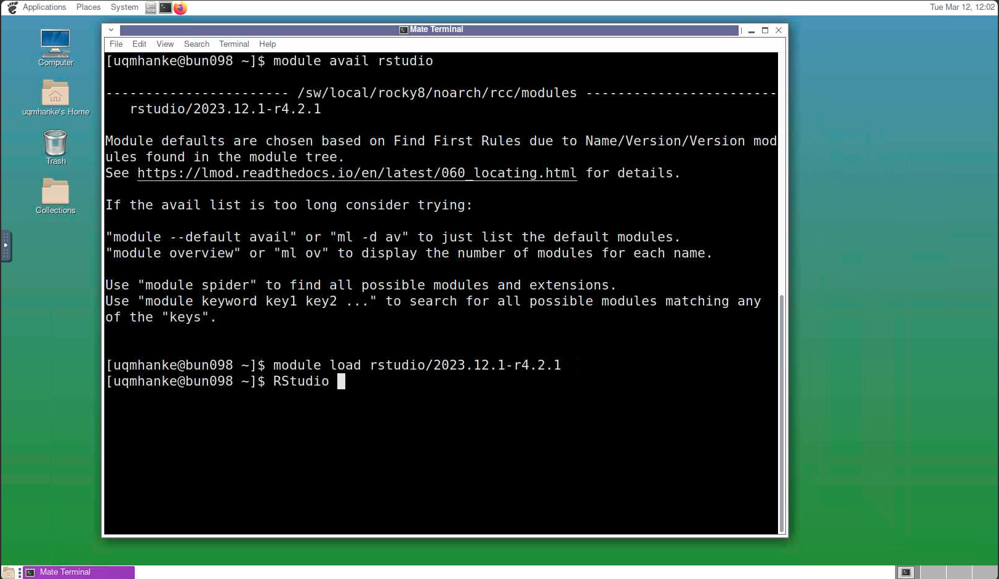

# onBunya User Guide

## What is onBunya?

onBunya is a web portal that provides access to the Bunya supercomputer, allowing users to submit and monitor jobs, manage files, and use a desktop environment to run graphical jobs using software such as Jupyter.

## Accessing OnDemand

Users cannot use onBunya unless they already have Bunya access. To apply for access to Bunya, [click here.](https://rcc.uq.edu.au/systems/high-performance-computing/bunya) and follow the instructions given under *Getting a Bunya account*.

Access onBunya [here](https://bunya-ondemand.rcc.uq.edu.au/), users will need to log in with AAF, and may receive an MFA prompt.

Please be patient as the onBunya dashboard loads, it can take time after authenticating.

## onBunya Dashboard

The options on the dashboard, *Files*, *Jobs*, *Clusters*, *Interactive Apps*, *My Interactive Sessions*, let users interact in different ways with Bunya.

**Interactive Apps** is the easiest way to set up an interactive session a Bunya CPU or GPU node. Please see below for more details.

### Files

Users can manage all of their files from their home directory, scratch and any scratch projects they have access to.

Users can rename, download or delete directories; view, edit, rename, download or delete individual files by clicking the 3 dots to the right of the file or directory name.

To access data in Research storage records (RDM storage records starting with Q) under /QRISdata pleae click on the "change directory" button and type in the full directory path (/QRISdata/Qnnnn, where n is a number), then click `okay`. Please be patient as it might take some time to load.

### Jobs

Users can view details of active jobs (and recently completed jobs) under Active Jobs.

New jobs can be created with the Job Composer. Creating a new job with the Job Composer does not submit the job to the Bunya queue. To submit to the queue, highlight the job to be submitted and click the green submit button.

Jobs can also be stopped or deleted on this page.

Please note that there are no job templates yet. 

### Clusters

Launch Bunya shell access in a new browser tab. Users will need to log in with account details as if they were accessing Bunya from the terminal, including MFA using DUO passcode or push. Please note that ssh keys will not work here.

This is similar to a standard ssh session on one of Bunya's login nodes. Do not run calculations in this session as this is on one of the login nodes. To run calculations or install software users are required to submit a batch or interactive job.

### Interactive Apps

Access to *Jupyter* notebook and Lab session (CPU and/or GPU) *GPU-Accelerated Desktop* (L40 NVIDIA GPU only), *Desktop* preset resource flavours (CPU and/or GPU) and *Expert Desktop* (CPU and/or GPU, allows custom request of resources). 

#### Important: If you get a "Could not connect to the session bus: Failed to connect ..." error

If you have the conda initialisation in your `.bashrc` file then you cannot use Open OnDemand. To use the virtual desktop in Open OnDemand, you need to have "clean" `.bashrc` file. The easiest way to clean it is to run  
`conda init --reverse`  

Please read the [Conda on Bunya Guide](https://github.com/UQ-RCC/hpc-docs/blob/main/guides/conda-environment.md) to set up your conda environment.

* **Jupyter** will launch a Jupyter notebook or Lab on a compute node. User will need to request appropriate resources.
* **GPU-Accelerated Desktop** will launch an accelerated interactive desktop session on a L40 NVIDIA compute node.
* **Desktop** will launch an interactive desktop on one of Bunya's compute nodes. Users can select from preset flavours with different cores and memory. Users can request a custem running time and add GPU to any of the preset flavours. The flavours are 
*Standard*: 4 cores (8 cpu threads), 32 GB of RAM 
*Medium*: 8 cores (16 cpu threads), 64 GB of RAM 
*High-RAM Medium*: 8 cores (16 cpu threads), 128 GB of RAM 
*Large*: 16 cores (32 cpu threads), 256 GB of RAM 
*Extra Large*: 24 cores (48 cpu threads), 512 GB of RAM 
*Huge*: 48 cores (96 cpu threads), 1000 GB of RAM
* **Expert Desktop** will launch an interactive desktop on one of Bunya's compute nodes. Users can custom request all resources.

 * Getting an interactive desktop session is not automatic when clicking on it.
 * Users should give their job a meaningful name, select target partition and resources they require as they would through the terminal on Bunya. The account string will autofill. For more information on resources available see the [Bunya user guide.](https://github.com/UQ-RCC/hpc-docs/blob/main/guides/Bunya-User-Guide.md)
 * If users choose a CPU job, the GPU field will be ignored and the job will not target GPU nodes.

Clicking on *Desktop* will bring up the following:

Most options are preset depending on which flavour is chosen. Users can select how long to run.

Clicking on *Expert Desktop* will bring up the following:

Most of the options offer drop down menues for you to select an option.  
* Please note that the *Partition* will display the default partition which is `debug`. This allows a maximum of 1 hour of time but also allows for shorter queue time. It is advised to keep the `debug` partition and the 1 hour time for work that will fit into this time limit.
* For longer or more substantial work please select the `general` partition or one of `gpu_cuda` (H100, A100, A100 MIG, L40), `gpu_viz` (L40 only) or `gpu_rocm` (AMD Mi210) partitions. Please consult the [Bunya user guide.](https://github.com/UQ-RCC/hpc-docs/blob/main/guides/Bunya-User-Guide.md) for more information.
* For most cases you should always choose *Number of Tasks (MPI only, otherwise leasve as 1)* as 1. Even for MPI, it is not advised to use interactive jobs or OOD desktops for MPI work, unless you are an expert and are willing to invest in extensive testsing.

 * After clicking launch, the page will redirect to the *My Interactive Sessions* page, the job number and status will appear. The user may need to wait for the resources to be allocated, once allocated the job status will change to "Running".

 * Click on Launch Desktop to open a new browser tab containing a desktop environment, users have file system access to all files (Caja), a terminal emulator (MATE terminal), internet browser access (Firefox), and other accessories such as text editors.
 * Users can use the terminal emulator to load modules, edit files, run jobs, etc. as normal on Bunya.

 

 * Once you are finished and the desktop is no longer needed close the browser tab with the desktop in your web browser.
 * Then you need to delete the job to free up the resources for other users.
 * Click the *Delete* button to finish your job and release the resources.

  

### My Interactive Sessions
* View and access any currently running interactive sessions.
* Users may have multiple sessions running at once.
* Users can kill running sessions by clicking Delete next to the desired session.

## Important Notes
* Users are still queueing for jobs to be scheduled as normal on Bunya, access to a desktop environment will not be instant.
* The job wall time will commence immediately upon resource allocation, monitor the Interactive Sessions page, as users will not be notified when the job starts.
* Matlab jobs should be run on a CPU desktop environment. If GPU resources are required, request a GPU partition (gpu_viz partition recommended) and use uq_vglrun.
* If running on a GPU desktop, accelerated Matlab MUST be run with the -nosoftwareopengl argument on GPU, and non-accelerated Matlab MUST NOT.
* If you have the conda initialisation in your `.bashrc` file then you cannot use Open OnDemand. To use the virutal desktop in Open OnDemand you need to have clean `.bashrc` file. The easiest was to clean it is to run  
`conda init --reverse`  
Please read the [Conda on Bunya Guide](https://github.com/UQ-RCC/hpc-docs/blob/main/guides/conda-environment.md) to set up your conda environment.

## Software

### CVL Apps

The *CVL Apps* can be found under *Applications* on the left in the top panel of the desktop. Please note that not all of these have been tested on Bunya. Please report any issues to rcc-support@uq.edu.au.

### RStudio

To use *RStudio* click on the terminal icon at the top. In the terminal type `module load rstudio/2023.12.1-r4.2.1`. To check if there are newer versions available type `module available rstudio` and then select the version you wish to use. Then type `RStudio`.

You can also select *RStudio* from the *CVL Apps*. Please see above.

### Gaussview (UQ only)

To use *Gaussview* click on the terminal icon at the top. In the terminal type `module load gaussian/16.b.01-gv`. To check if there are newer versions available type `module available gaussian` and then select the version you wish to use. Then type `gv`.

### Mathematica (UQ only)

To use *Mathematica* click on the terminal icon at the top. In the terminal type `module load mathematica/14.0`. To check if there are newer versions available type `module available mathematica` and then select the version you wish to use. Then type `Mathematica`.

You can also select *Mathematica* from the *CVL Apps*, see above.

### SPSS Statistics (UQ only)

To use *SPSS Statistics* click on the terminal icon at the top. In the terminal type `module load spss/statistics-27`. To check if there are newer versions available type `module available spss` and then select the version you wish to use. Then type `stats`.

