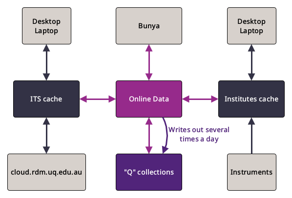

# UQRDM overview

UQ Research Data Manager (UQRDM) allows all UQ researchers to store and share active research data safely and securely with internal and external collaborators. UQRDM is also the university's thesis submission and tracking service, and integrates with the university research repository eSpace. 
https://rdm.uq.edu.au

UQRDM User Guides provide information and step by step "howtos" and contain the answer to most questions and concerns. 
https://guides.library.uq.edu.au/for-researchers/uq-research-data-manager

PhD students should make sure that they have read the specific instructions on how to setup a UQRDM for a PhD student as it will avoid typical access problems and questions. PhD students should set up their UQRDM with their student account but should add their staff account as a collaborator. This will enable access no matter with which account they are logged into a service. 
https://guides.library.uq.edu.au/for-researchers/uq-research-data-manager/hdr-support

The first point of contact for questions and problems is the UQRDM support team. They are able to triage the question or problem and then assign to the right team or person. Please make sure to select UQ Research Data Manager. 
https://support.staff.uq.edu.au/app/opa/research_support

The term *RDM* is often applied in general terms for storage. In more detail, an RDM consits of a *Research Record* and added *Services* such as a *Storage Record*. The *Storage Record* is the space where the user can store their data.

There are 3 different types of *Storage Record*: general data (A storage record), indentifiable data (I storage record), HPC available data (Q storage record). The user must select one type when the *Storage Record* is added and this cannot be changed once the *Storage Record* has been created. Only Q *Storage Records* (Q RDM or Q collection) are accessible through HPC Bunya.

## UQRDM Q storage records

A UQRDM Q storage record is safe, backed up, and recoverable storage for research data. Q storage records are automaticaly available on Bunya and onBunya.

>[!IMPORTANT]
>**UQRDM Q storage records should not be used as storage for active computations.** UQRDM Q storage records should not be used for rapidly changing data or simultaneous modification of the same file by multiple users (e.g. one person changing one field in a spreadsheet whilst somebody else has it open and is editing a different one) or in multiple locations (i.e. you should not edit a file on cloud.rdm.uq.edu.au or via HPC Bunya and on your desktop at the same time).  The total number of files available per Q storage record is limited (the default is one million) and lots of small files is slower to transfer than a few large files. UQRDM works best when files that are not being frequently used are stored in archive files (e.g. tar, zip, 7zip, rar) before being backed up to RDM. 

The diagram above shows a simplified view of the different ways (paths) a Q storage record can be accessed. 
* *"Q" collections* represent the tape part of the RDM. Data here is backed up and can be recovered if it has been deleted or corrupted recently.
* *ITS cache*, *Institute cache*, and *Online data* represent intermediate disk layers. When writing to a Q storage record data is first staged into the respective cache.
* If you have `\\uq.edu.au\UQ-Inst-Gateway1`, `\\uq.edu.au\UQ-Inst-Gateway2`, which map to `data.<institute>.uq.edu.au`, e.g. `data.aibn.uq.edu.au`, `data.imb.uq.edu.au`, `data.qbi.uq.edu.au`, and `data.cai.uq.edu.au`, in the mount path on your desktop/laptop then you are using the Institute cache.
* If you have `shares.rdm.uq.edu.au`, or `shares01.rdm.uq.edu.au`, or `shares02.rdm.uq.edu.au`in the mount path on your desktop/laptop then you are using the ITS cache.
  
* When data is written to a Q storage record from Bunya the data is first staged to RCC's Online data.
* When data is written to a Q storage record from a desktop/laptop/instrument connected to the Institute cache the data is first staged to the Institute cache. It is then staged from the Institute cache to RCC's Online data.
* When data is written to a Q storage from a desktop/laptop connected to the ITS cache the data is first staged to the ITS cache. It is then staged from the ITS cache to RCC's Online data.
* When data is written to a Q storage from cloud.rdm.uq.edu.au the data is first staged to the ITS cache. It is then staged from the ITS cache to RCC's Online data.
* Data in RCC's Online data is staged (written) to Q collections (tape) several times a day. **Important** Data that has not yet been staged to tape is not yet save and not yet backed up.

* When data is read from a Q storage record in the Q collections from Bunya data might need to be staged to RCC's Online data from tape first. This might cause a slight delay.
* When data is read from a Q storage record in the Q collections from a desktop/laptop connected via the Institute cache then the data might need to be staged to the Institute cache via RCC's Online data from tape first. This might cause a slight delay.
* When data is read from a Q storage record in the Q collections from a desktop/laptop connected via the ITS cache then the data might need to be staged to the ITS cache via RCC's Online data from tape first. This might cause a slight delay.
* When data is read from a Q storage record in the Q collections from cloud.rdm.uq.edu.au then the data might need to be staged to the ITS cache via RCC's Online data from tape first. This might cause a slight delay.
* Data that has not been accessed in a while will be cleared from the caches. When it is accessed again it will need to be recalled from tape back to the respective caches.

* When data is written or deleted or moved, changes might not appear instantly via all different access paths. The process to sync all caches can take some time. 

The following points outline what this means for common user questions and problems.

## FAQ

#### I can see files/folders in my Q storage record on Bunya but I cannot see them from my desktop/laptop
1) The files/folders have been written to RDM recently. The changes are not instantly visible via the Institute or ITS cache as they need to sync first.
2) The files/folders have been written to RDM at least a few hours ago. There might be a syncing problem. If this concerns the ITS cache please contact the RDM team about this problem. If this concenrs the Institute cache then please contact RCC.

#### 

